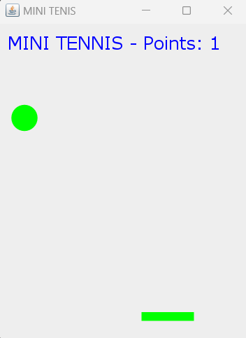
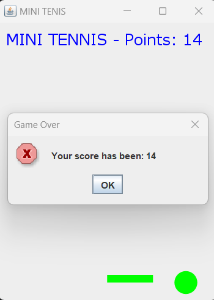

# Single-Player Tennis Game in Java

## Overview
This project is a single-player tennis game developed in Java. The game features a ball and a rectangular paddle, controlled by the player using arrow keys. The objective is to keep the ball bouncing off the paddle for as long as possible to achieve the highest score.

## Gameplay
- The player controls the movement of the rectangular paddle using the arrow keys.
- The ball moves across the screen, bouncing off walls and the paddle.
- Each time the ball collides with the paddle, the player's score increases by 1, and the ball's velocity increases.
- The game continues until the ball misses the paddle and hits the wall, resulting in the player losing.
- Throughout the game, entertaining sound effects enhance the user experience:
    - Background music from Mario Bros plays while the game is in progress.
    - A spark sound effect plays each time the ball hits a wall.
    - Upon losing, the iconic "d'oh" sound from Homer Simpson is played.

## User Interface
- The game features a simple user interface with a score display at the upper part of the window, showing the current score updated in real-time as the player hits the ball.
- The interface also includes visuals, with images displayed at the beginning and end of the game:
<div style="display: flex; justify-content: center;">
    
    
</div> 

## How to Run
To run the game, navigate to ```src/juego``` and execute ```Game.java```.

## Conclusion
With engaging gameplay, entertaining sound effects, and visual enhancements, this tennis game offers players an enjoyable experience. Test your reflexes and aim for the highest score!


